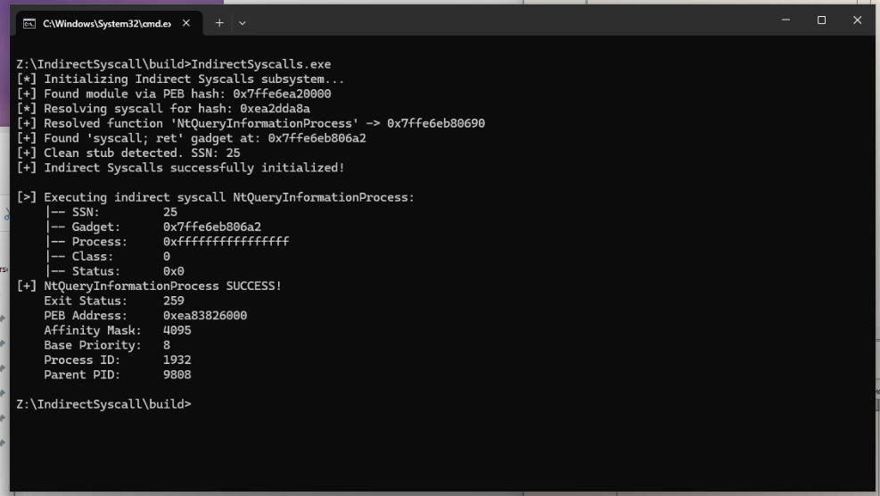
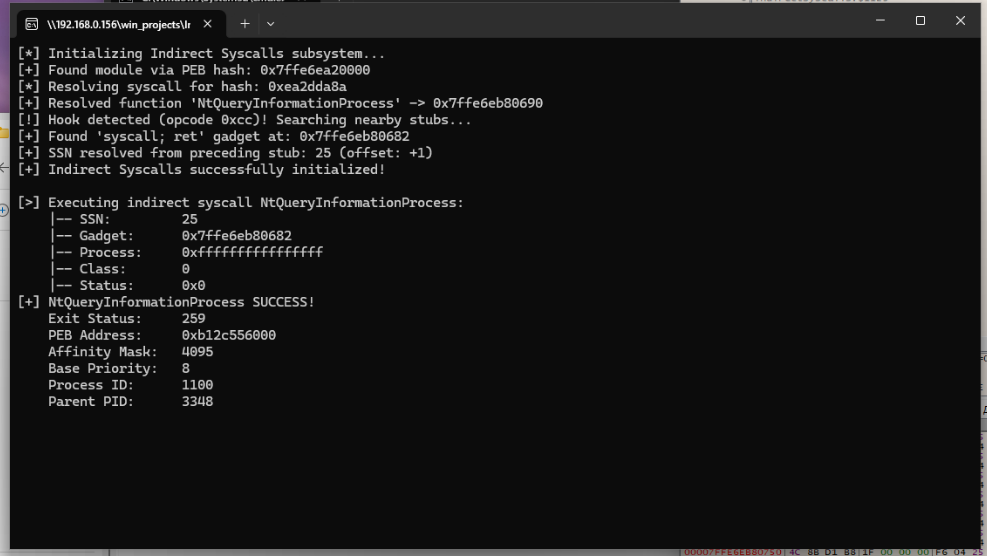
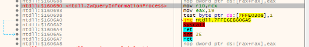

# IndirectSyscalls

<p align="center">
  <b>Windows x64 indirect system-call research PoC</b>
</p>

<p align="center">
  Dynamic syscall resolution through the PEB and PE export table, syscall stub inspection, SSN recovery, and indirect invocation of a native Windows API.
</p>

---

## Overview

**IndirectSyscalls** is a small Windows x64 research PoC demonstrating how a native system call can be resolved and invoked without directly importing the target `Nt*` function through the normal Win32 API path.

The project focuses on Windows internals rather than payload execution. It demonstrates:

- PEB-based module enumeration
- FNV-1a API/module hashing
- Manual PE export table parsing
- Dynamic resolution of `NtQueryInformationProcess`
- Syscall stub inspection
- System Service Number (SSN) extraction
- Discovery of a `syscall; ret` instruction sequence
- Recovery of an SSN from a neighboring syscall stub when the target stub is modified
- Indirect syscall invocation through a small assembly wrapper

The default demonstration uses `NtQueryInformationProcess` with `ProcessBasicInformation` and prints the returned process information.

> **Educational / research project.** This repository is intended for learning and experimentation with Windows internals and native system-call mechanisms.

---

## Demonstration

### Normal execution

The resolver locates `ntdll.dll` through the PEB, resolves `NtQueryInformationProcess` from the PE export table, extracts its SSN, finds a `syscall; ret` gadget, and successfully invokes the native API.



### Modified syscall stub

The target syscall stub is intentionally modified for testing. The resolver detects the unexpected opcode and searches neighboring syscall stubs to recover the SSN.



The fallback path shown above resolves the SSN from a preceding clean syscall stub:

```text
Modified target stub
        |
        v
Unexpected prologue detected
        |
        v
Search neighboring syscall stubs
        |
        v
Clean preceding stub found
        |
        v
Recover target SSN
        |
        v
Locate syscall; ret
        |
        v
Indirect syscall succeeds
```

### Syscall stub inspection

Static inspection of the native syscall stub shows the expected x64 sequence used by the resolver:



Conceptually:

```asm
mov r10, rcx
mov eax, <SSN>
syscall
ret
```

---

## Execution flow

```text
                     +----------------------+
                     |      PEB lookup      |
                     |   Find ntdll.dll     |
                     +----------+-----------+
                                |
                                v
                     +----------------------+
                     |   PE export parser   |
                     | Resolve Nt* by hash  |
                     +----------+-----------+
                                |
                                v
                     +----------------------+
                     |  Inspect syscall     |
                     |       stub           |
                     +----------+-----------+
                                |
                    +-----------+-----------+
                    |                       |
                    v                       v
             Clean prologue          Modified stub
                    |                       |
                    |                       v
                    |              Search neighboring
                    |              syscall stubs
                    |                       |
                    +-----------+-----------+
                                |
                                v
                     +----------------------+
                     |      Extract SSN     |
                     +----------+-----------+
                                |
                                v
                     +----------------------+
                     | Find syscall; ret    |
                     |       gadget         |
                     +----------+-----------+
                                |
                                v
                     +----------------------+
                     |  Assembly wrapper    |
                     |  UniversalSyscall    |
                     +----------+-----------+
                                |
                                v
                     +----------------------+
                     | NtQueryInformation-  |
                     | Process invocation   |
                     +----------------------+
```

---

## Technical details

### 1. PEB-based module resolution

The project accesses the current process PEB and walks the loader's module list.

The module name is hashed with FNV-1a and compared against the requested hash:

```cpp
g_Ntdll = GetModuleByHash(HASHW(L"ntdll.dll"));
```

This allows the PoC to locate `ntdll.dll` without directly resolving it through a conventional module lookup call.

### 2. Manual PE export resolution

`GetProcAddressByHash()` parses the PE export directory manually.

The resolver walks:

- `AddressOfNames`
- `AddressOfNameOrdinals`
- `AddressOfFunctions`

and compares FNV-1a hashes of exported function names.

For the demonstration, the target export is:

```text
NtQueryInformationProcess
```

### 3. Syscall number extraction

For an unmodified x64 syscall stub, the PoC expects the standard prologue:

```text
4C 8B D1 B8 xx xx xx xx
```

which corresponds to:

```asm
mov r10, rcx
mov eax, <SSN>
```

The 32-bit value following `B8` is extracted as the System Service Number.

### 4. `syscall; ret` gadget discovery

The resolver scans the target stub for:

```text
0F 05 C3
```

corresponding to:

```asm
syscall
ret
```

The address of this sequence is stored as the indirect syscall target.

### 5. Modified-stub fallback

For research purposes, the PoC can recognize a modified syscall stub when its first opcode is `E9` or `CC`.

When this happens, it searches neighboring syscall stubs and uses the known SSN relationship to calculate the target SSN.

The mechanism is **Halo's Gate-style** in the sense that it uses neighboring syscall stubs to recover information when the target stub cannot be parsed normally.

This implementation intentionally remains small and focused; it does not attempt to model every possible hook or modified stub layout.

### 6. Assembly syscall wrapper

The C++ code prepares a `SYSCALL_CONTEXT` containing:

- SSN
- `syscall; ret` gadget address
- register arguments (`RCX`, `RDX`, `R8`, `R9`)
- additional stack arguments

The assembly wrapper sets up the Windows x64 calling convention and transfers control to the resolved syscall gadget.

---

## Example output

A successful execution looks like:

```text
[*] Initializing Indirect Syscalls subsystem...
[+] Found module via PEB hash: 0x7ffe6ea20000
[*] Resolving syscall for hash: 0xea2dda8a
[+] Resolved function 'NtQueryInformationProcess' -> 0x7ffe6eb80690
[+] Found 'syscall; ret' gadget at: 0x7ffe6eb806a2
[+] Clean stub detected. SSN: 25
[+] Indirect Syscalls successfully initialized!

[>] Executing indirect syscall NtQueryInformationProcess:
    |-- SSN:         25
    |-- Gadget:      0x7ffe6eb806a2
    |-- Process:     0xffffffffffffffff
    |-- Class:       0
    |-- Status:      0x0
[+] NtQueryInformationProcess SUCCESS!
    Exit Status:     259
    PEB Address:     0xea83826000
    Affinity Mask:   4095
    Base Priority:   8
    Process ID:      1932
    Parent PID:      9808
```

The exact addresses and process-specific values will vary between executions.

---

## Project structure

```text
IndirectSyscalls/
├── CMakeLists.txt
├── llvm-mingw-toolchain.cmake
├── docs/
│   ├── normal_execution.png
│   ├── hook_detection.png
│   └── syscall_stub.png
└── src/
    ├── IndirectSyscalls.cpp
    ├── IndirectSyscalls.h
    ├── Utils.h
    ├── main.cpp
    ├── syscall.s
    └── syscall.asm
```

---

## Requirements

- Windows x64
- CMake
- C++17-compatible compiler
- One of:
  - Microsoft Visual C++ / Visual Studio
  - LLVM-MinGW

The project contains an LLVM-MinGW toolchain file for cross-compilation from a suitable Linux build environment.

---

## Build

### MSVC

Configure the project with CMake using the Visual Studio generator:

```powershell
cmake -S . -B build
cmake --build build --config Release
```

The MSVC build uses the MASM assembly source.

### LLVM-MinGW

Using the included toolchain file:

```bash
cmake -S . -B build \
    -DCMAKE_TOOLCHAIN_FILE=llvm-mingw-toolchain.cmake \
    -DCMAKE_BUILD_TYPE=Release

cmake --build build
```

The LLVM-MinGW build uses the GNU/Clang-compatible assembly source.

---

## Implementation notes

This project is deliberately implemented as a compact PoC rather than a production-grade syscall framework.

Some assumptions and limitations include:

- The implementation targets Windows x64.
- Syscall stub layouts may differ between Windows versions and builds.
- The neighboring-stub fallback relies on assumptions about syscall stub ordering and spacing.
- The PE export parser is intentionally minimal and does not implement every possible PE export edge case.
- Forwarded exports are not handled.
- The hook/modified-stub detection covers only the patterns implemented by this PoC.
- The project uses `iostream` for readable console output; consequently, the executable retains normal C++ runtime-related imports.

These limitations are intentional trade-offs for keeping the research code understandable.

---

## What this demonstrates

| Component | Purpose |
|---|---|
| PEB | Locate loaded modules |
| FNV-1a | Hash module/export names |
| PE export directory | Resolve functions manually |
| Syscall stub | Obtain the native syscall number |
| `syscall; ret` | Indirect syscall transfer target |
| Neighboring stubs | Fallback SSN recovery |
| x64 assembly | Prepare and invoke the syscall |
| `NtQueryInformationProcess` | Benign native API demonstration |

---

## Related research topics

Useful areas to explore alongside this project:

- Windows x64 calling convention
- PEB and loader internals
- PE/COFF export tables
- Native NT API
- System Service Numbers (SSNs)
- x64 syscall stubs
- Direct vs. indirect system calls
- Windows process internals
- Reverse engineering with x64dbg / WinDbg / IDA / Ghidra

---

## Disclaimer

This project is provided for **educational purposes and authorized security research**.

The techniques demonstrated here interact with low-level Windows internals and should only be tested on systems and software you own or are explicitly authorized to analyze.

The repository is not intended to provide a complete offensive security framework or production-ready implementation.

---

## License

See the repository license for applicable terms.